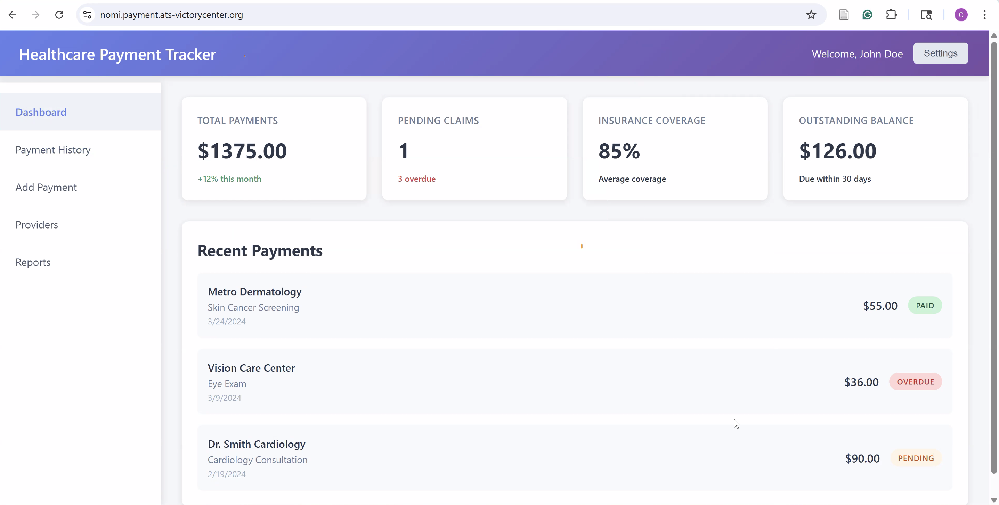
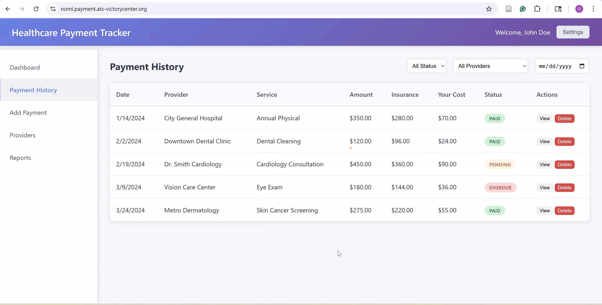
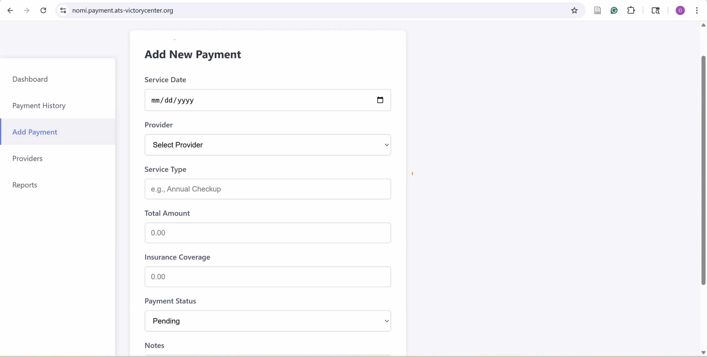
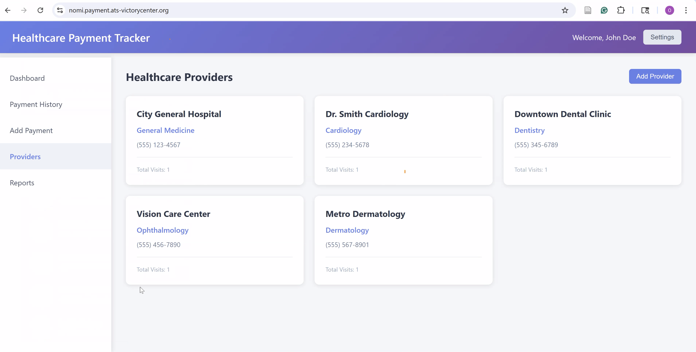

# Healthcare Payment Tracker - Secure HTTPS Deployment

A containerized healthcare payment tracking application built with HTML, CSS, JavaScript, and deployed using Docker Compose with Nginx and Traefik reverse proxy for automatic HTTPS certificates.

## 🌐 Live Application
**Production URL:** [https://nomi.payment.ats-victorycenter.org](https://nomi.payment.ats-victorycenter.org)
**Traefik Dashboard:** [https://traefik.nomi.payment.ats-victorycenter.org](https://traefik.nomi.payment.ats-victorycenter.org) (admin/admin)

## 🚀 Quick Start

### Prerequisites
- Docker installed on your system
- Docker Compose installed on your system
- Domain name pointing to your server (for HTTPS)

### Option 1: HTTPS Deployment (Recommended)

1. **Navigate to the project directory:**
   ```bash
   cd NOMI-Healthcare_payment_tracker_app
   ```

2. **Run the automated HTTPS setup:**
   ```bash
   chmod +x setup-https.sh
   ./setup-https.sh
   ```

3. **Access the application:**
   - **Secure HTTPS:** https://nomi.payment.ats-victorycenter.org
   - **Dashboard:** https://traefik.nomi.payment.ats-victorycenter.org

### Option 2: Local HTTP Deployment

1. **For local testing without domain:**
   ```bash
   # Create simple network
   docker network create traefik
   
   # Start only the healthcare app
   docker compose up healthcare-app -d --build
   ```

2. **Access locally:**
   ```
   http://localhost:8080
   ```

### Docker Commands

- **Start with HTTPS:**
  ```bash
  docker compose up -d
  ```

- **Stop the application:**
  ```bash
  docker compose down
  ```

- **View logs:**
  ```bash
  docker compose logs -f traefik
  docker compose logs -f healthcare-app
  ```

- **Rebuild and restart:**
  ```bash
  docker compose up -d --build --force-recreate
  ```

- **Check container status:**
  ```bash
  docker compose ps
  ```

- **Check SSL certificate:**
  ```bash
  ./check_cert.sh
  ```

## 🏗️ Architecture

### Container Stack
- **Reverse Proxy:** Traefik v3.0 with automatic HTTPS
- **Base Image:** `nginx:alpine` (lightweight and secure)
- **Web Server:** Nginx with custom configuration
- **Network:** Traefik bridge network with SSL termination
- **SSL Certificates:** Let's Encrypt with auto-renewal
- **Port Mapping:** 80 (HTTP) → 443 (HTTPS) → Container 80

### File Structure
```
NOMI-Healthcare_payment_tracker_app/
├── index.html          # Main application HTML
├── app.js              # JavaScript application logic
├── styles.css          # Application styles
├── Dockerfile          # Container build instructions
├── docker-compose.yml  # Container orchestration with Traefik
├── nginx.conf          # Nginx web server configuration
├── traefik.yml         # Traefik reverse proxy configuration
├── setup-https.sh      # Automated HTTPS setup script
├── check_cert.sh       # Certificate monitoring script
├── acme.json           # Let's Encrypt certificate storage
├── .dockerignore       # Files to exclude from build
├── AWS-DEPLOYMENT.md   # AWS deployment guide
└── README.md          # This file
```

## ⚙️ Configuration

### Traefik Features
- **Automatic HTTPS:** Let's Encrypt SSL certificates
- **HTTP to HTTPS Redirect:** Automatic secure redirects
- **Load Balancing:** Multiple container support
- **Health Monitoring:** Built-in health checks
- **Dashboard:** Web UI for monitoring
- **Auto-renewal:** SSL certificates renew automatically

### Nginx Features
- **Gzip Compression:** Enabled for better performance
- **Security Headers:** XSS protection, content type options
- **Static Asset Caching:** 1-year cache for CSS/JS files
- **Health Check Endpoint:** `/health` for monitoring
- **Single Page App Support:** Fallback routing to index.html

### Docker Compose Configuration
```yaml
services:
  traefik:
    image: traefik:v3.0
    ports:
      - "80:80"     # HTTP
      - "443:443"   # HTTPS
      - "8080:8080" # Dashboard
    
  healthcare-app:
    build: .
    labels:
      - "traefik.http.routers.healthcare-https.rule=Host(`nomi.payment.ats-victorycenter.org`)"
      - "traefik.http.routers.healthcare-https.tls.certresolver=letsencrypt"
```

## 🔧 Customization

### Change Domain
Edit `docker-compose.yml` and update the Host rule:
```yaml
labels:
  - "traefik.http.routers.healthcare-https.rule=Host(`your-domain.com`)"
```

### Environment Variables
Add environment-specific configurations in `docker-compose.yml`:
```yaml
environment:
  - NODE_ENV=production
  - API_URL=https://api.example.com
```

### Volume Persistence
SSL certificates and data are automatically persisted:
```yaml
volumes:
  - traefik-certificates:/certificates
  - healthcare-data:/usr/share/nginx/html/data
```

### Custom Email for Let's Encrypt
Edit `traefik.yml`:
```yaml
certificatesResolvers:
  letsencrypt:
    acme:
      email: your-email@domain.com
```

## 🔍 Monitoring

### Health Check
The application includes multiple health endpoints:
```bash
# App health
curl https://nomi.payment.ats-victorycenter.org/health

# Traefik API
curl https://traefik.nomi.payment.ats-victorycenter.org/api/http/routers
```

### SSL Certificate Status
```bash
# Check certificate expiry
./check_cert.sh

# View certificate details
openssl s_client -connect nomi.payment.ats-victorycenter.org:443 -servername nomi.payment.ats-victorycenter.org
```

### Container Metrics
View container resource usage:
```bash
docker stats traefik healthcare-payment-tracker
```

### Traefik Dashboard
Monitor your services at: https://traefik.nomi.payment.ats-victorycenter.org
- Username: `admin`
- Password: `admin`

## 🔒 Security

### Enhanced Security Features
- **HTTPS Only:** All traffic encrypted with TLS 1.2+
- **HSTS Headers:** Force HTTPS in browsers
- **Security Headers:** XSS, CSRF, clickjacking protection
- **Auto SSL Renewal:** Certificates renewed before expiry
- **Server Tokens Disabled:** Hide server information
- **Content Security Policy:** Prevent XSS attacks

### SSL/TLS Configuration
- **TLS Version:** Minimum TLS 1.2
- **Cipher Suites:** Modern, secure ciphers only
- **Certificate:** Let's Encrypt with 90-day auto-renewal
- **OCSP Stapling:** Enabled for performance

## 🐛 Troubleshooting

### Common Issues

1. **Port Already in Use:**
   ```bash
   # Find process using port 8080
   netstat -tulpn | grep :8080
   # Or change port in docker-compose.yml
   ```

2. **Container Won't Start:**
   ```bash
   # Check logs for errors
   docker-compose logs healthcare-app
   ```

3. **Application Not Loading:**
   ```bash
   # Verify container is running
   docker-compose ps
   # Check if files are copied correctly
   docker exec -it healthcare-payment-tracker ls -la /usr/share/nginx/html/
   ```

4. **Permission Issues:**
   ```bash
   # Rebuild with no cache
   docker-compose build --no-cache
   ```

### Logs Location
- **Nginx Access Logs:** `/var/log/nginx/access.log`
- **Nginx Error Logs:** `/var/log/nginx/error.log`
- **Container Logs:** `docker-compose logs`

## 📊 Features

- **Payment Tracking:** Manage healthcare payments and claims
- **Provider Management:** Track healthcare providers
- **Dashboard Analytics:** Visual overview of payment statistics
- **Data Export:** CSV export functionality
- **Responsive Design:** Mobile and desktop friendly
- **Offline Capable:** No external dependencies

## 🚀 Production Deployment

For production deployment, consider:

1. **Use HTTPS:** Add SSL certificates and configure Nginx for HTTPS
2. **Environment Variables:** Store sensitive configuration externally
3. **Health Checks:** Implement proper health monitoring
4. **Backup Strategy:** Regular backups of application data
5. **Resource Limits:** Set memory and CPU limits in docker-compose.yml

### Production Example
```yaml
services:
  healthcare-app:
    build: .
    restart: always
    deploy:
      resources:
        limits:
          memory: 256M
          cpus: '0.5'
    healthcheck:
      test: ["CMD", "curl", "-f", "http://localhost/health"]
      interval: 30s
      timeout: 10s
      retries: 3
```


## Your URLs:

  - Healthcare App: https://nomi.payment.ats-victorycenter.org


## DEPLOYED ON AWS EC2 SERVER


## NOMI DASHBOARD


## NOMI PAYMENT HISTORY


## NOMI ADD PAYMENT


## NOMI PROVIDERS



## 📝 License

This project is for demonstration purposes. Ensure compliance with healthcare data regulations (HIPAA, etc.) before using in production environments.